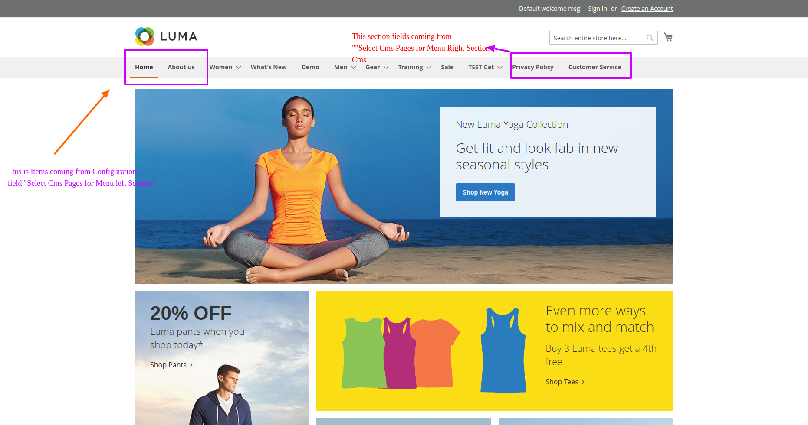

Magento2 add a cms page link to menu
========================

## Who is developing this module ? 

This module is built by Amit Bera, [Magento StackExchange Moderator](https://magento.stackexchange.com/users/4564/amit-bera?tab=profile) & Magento Certified Developer & Consultant. 

## Feature of this extension

### Add cms page to Magento default menu at left and right section

**Manage Pages section and Sort Order from admin Configuration.**

Ability add cms pages and it's sort Order from Admin System Configuration.

## Documentation

## Standards & Code Quality

Built on top of Magento2, our module respects all its prerequisites and code quality rules.

