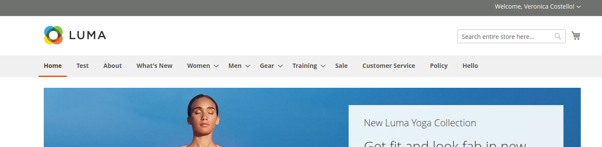
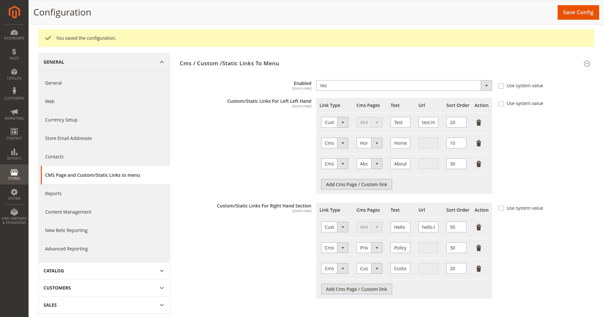

Magento2 add a cms page link to menu and add a Custom page link to menu
========================

## Who is developing this module ? 

Built by Amit Bera, [Magento StackExchange Moderator](https://magento.stackexchange.com/users/4564/amit-bera?tab=profile) & Magento Certified Developer & Consultant.
# Contact at

- @website https://www.amitbera.com/contact/
- @E-mail dev.amitbera@gmail.com
- @Skype dev.amitbera

# Version: 1.3.0

 ## 1. Documentation

**Comming Soon**
 
## 2. How to install Extension

## Installation Process using Zip

1. Download the extension .zip file from github https://github.com/devamitbera/magento2-add-cms-pages-to-menu.
2. Copy the extension  to the `{magento2-root-dir}/app/code/DevBera/CmsLinkToMenu` 
3. Run the following series of command from SSH console of your server to install  the extension

#a)  Enable the extension : `php bin/magento module:enable DevBera_CmsLinkToMenu  --clear-static-content`

#b)  Run setup  Command `php bin/magento setup:upgrade`.

#c)  Run [setup di compile](https://devdocs.magento.com/guides/v2.3/config-guide/cli/config-cli-subcommands-compiler.html) `php bin/magento setup:di:comple`.

#d)  Do the [static content deploy](https://devdocs.magento.com/guides/v2.3/config-guide/cli/config-cli-subcommands-static-view.html) `bin/magento setup:static-content:deploy`

## Install using Composer

**Run below command at your magento root directory to add my package using Composer:**

`composer require devbera/module-cmslinktomenu`
 
 Package will be  clone at **vendor/devbera/module-cmslinktomenu** at your
 
 After cloning,you have to install this extension at your system by follow below steps:
 
 
#a)  Enable the extension : `php bin/magento module:enable DevBera_CmsLinkToMenu  --clear-static-content`

#b)  Run setup  Command `php bin/magento setup:upgrade`.

#c)  Run [setup di compile](https://devdocs.magento.com/guides/v2.3/config-guide/cli/config-cli-subcommands-compiler.html) `php bin/magento setup:di:comple`.

#d)  Do the [static content deploy](https://devdocs.magento.com/guides/v2.3/config-guide/cli/config-cli-subcommands-static-view.html) `bin/magento setup:static-content:deploy`
 
## 3. Highlight features:

### 1. Ability to add cms page to Magento default menu at left and right end.

### 2. Ability to add Custom links to Magento default menu at left and right end.

# Frontend View

# Admin Setting : Add Cms Pages & static links from admin

 - **Ability manahe sort Order from Admin System Configuration.**

## 4. Configure. 
# Video Demo 
 - Admin Setting Demo https://www.youtube.com/watch?v=jIWpNxtaPUw
 - Frontend View Demo https://www.youtube.com/watch?v=sW7EJG2ld8k

**Comming Soon**

## 4. User Guide

**Comming Soon**

## Standards & Code Quality

Built on top of Magento2, our module respects all its prerequisites and code quality rules.

